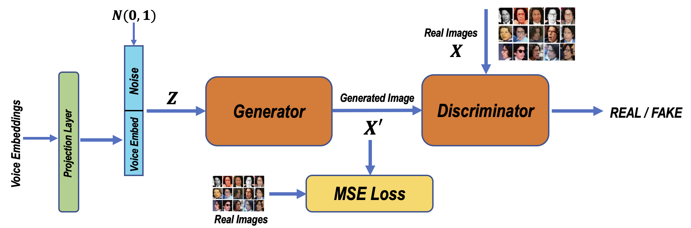
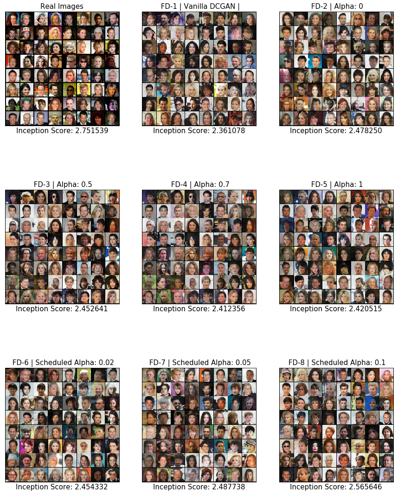

# Face-Generation-from-Speech

## Implementation Details - VoiceGAN

#### Overall architecture of our VoiceGAN:

### Details
1. Face Embedding Extraction from Pre-trained DeepSphere Model
2. Kaldi VoxCeleb X-Vector Extraction
3. Joint Embedding Network using MLP
4. Conditional DC GAN for Image Synthesis with Scaling Loss

### Datasets:
VGGFace2, Voxceleb2, Voxceleb1 (Used only for X-Vector training)

- This work uses X-Vector Speaker Embeddings, with Deepsphere face Embeddings to train a joint embedding network using the N-Pair Loss. The obtained embeddings are used to generate face images conditioned on provided speaker embeddings shifted to a joint embedding space.

# Preliminary Results
Example faces generated solely conditioned on speech input.

# Additional Resources
## Papers
* [ProGAN](https://arxiv.org/pdf/1710.10196.pdf)
* [AttnGAN](https://arxiv.org/pdf/1711.10485.pdf)
* [Text to Face Generation](https://medium.com/@animeshsk3/t2f-c-using-deep-learning-b3b6ba5a5a93)
* [Generating custom photo realistic faces](https://blog.insightdatascience.com/generating-custom-photo-realistic-faces-using-ai-d170b1b59255)

* [VGGFaces2](http://www.robots.ox.ac.uk/~vgg/data/vgg_face2/)
* [VoxCelebs](http://www.robots.ox.ac.uk/~vgg/data/voxceleb/)
* [Kaldi SRE X-Vectors](https://david-ryan-snyder.github.io/2017/10/04/model_sre16_v2.html)
* [The Triplet Loss Implementation](https://arxiv.org/pdf/1901.08616.pdf)

## Related Code Repositories
* [ProGAN (PyTorch Code)](https://github.com/akanimax/pro_gan_pytorch)
* [Speech2face-UPC](https://github.com/imatge-upc/speech2face)
* [Kaldi Voxforge](https://github.com/kaldi-asr/kaldi/tree/master/egs/voxceleb/v2)
